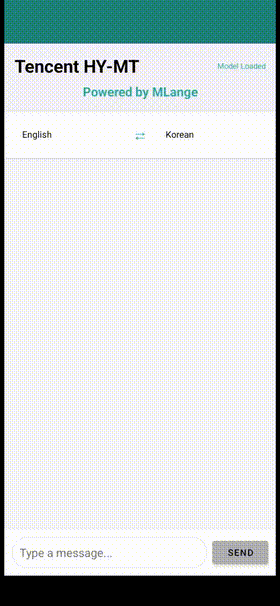
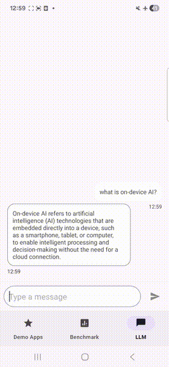
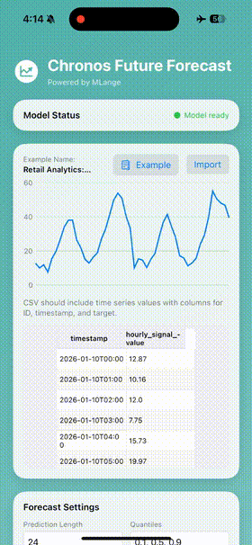
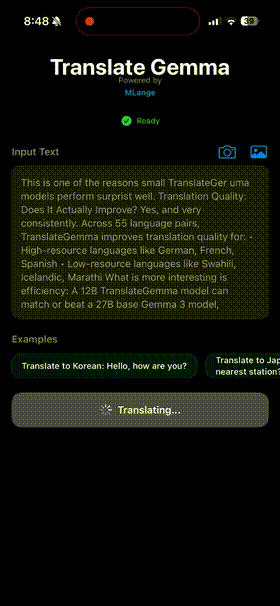

<div align="center">

# MeLange Applications

**Open Source, On-device AI Apps**

[](LICENSE)
[](.)
[](https://zetic.ai)

<a href="https://docs.zetic.ai"></a>
<a href="https://mlange.zetic.ai"></a>
<a href="https://play.google.com/store/apps/details?id=com.zeticai.zeticapp"></a>
<a href="https://apps.apple.com/app/zeticapp/id6739862746"></a>
<a href="https://discord.gg/gqhDWfZbgU"></a>

<br/>

<h1>Build Local, NPU-Accelerated AI Apps</h1>

<h3>
Production-ready source code for on-device AI. <br>
Automated conversion. Full NPU speed. Deployed in hours.
</h3>

[Quick Start](#-quick-start) • [Available Models](#-available-models) • [Documentation](https://docs.zetic.ai) • [Contribute](#-contributing)


| | | | |
|:---:|:---:|:---:|:---:|
|  |  |  |  |

</div>

<br/>

## 📖 About This Repository

Welcome to the collection of **open-source, on-device AI applications** built with [**MeLange**](https://mlange.zetic.ai). These are not just demos, they are **production-grade apps** running entirely locally. They demonstrate how to run AI models directly on user devices with **full NPU acceleration**. By using MeLange's automated optimization, what used to require months of hardware-specific tuning now takes just hours.

### What is MeLange?

**MeLange** is an **NPU-native platform** that takes your AI model and turns it into a production-ready mobile app automatically. At [ZETIC.ai](https://zetic.ai) we built MeLange to make AI **Faster, Cheaper, Safer, and Independent**.

#### Why MeLange?

Here's what makes MeLange special:

- 🚀 **Up to 60x Faster** - Full NPU acceleration that delivers real-time, zero-latency performance.
- **🔒 Private & Offline** - Everything runs on-device. No internet, no cloud costs, no data leaks.
- ⏱️ **Deploy in 1 Hour** - Automated conversion from raw model to mobile SDKs (no manual tuning required) in hours, not weeks.
- 📱 **Production Tested** - Benchmarked on 200+ devices to ensure reliability.
- 💻 **3 Lines of Code** - All you need to integrate with our unified Android/iOS API
- 📚 **Multiple Model Sources** - Support for custom model uploads, Hugging Face links, and our curated library.


### Why This Repository?

We've put together real, working examples to help you build with **MeLange**:

- ✅ **Production-Ready Code** - Complete, deployable apps (not just toy demos) showing best practices
- ✅ **Multiple Use Cases** - Computer vision, NLP, audio processing, and more
- ✅ **Universal Support** - Learn patterns that work across both Android and iOS
- ✅ **Open Source** - Apache 2.0 licensed. Use it however you want.

<br/>

## 🚀 Quick Start

Get started with MeLange in minutes:

```bash
# 1. Clone the repository
git clone https://github.com/zetic-ai/ZETIC_Melange_apps.git
cd ZETIC_Melange_apps

# 2. Get your free MeLange API key
# Sign up at https://mlange.zetic.ai and get your personal access token

# 3. Configure your API key (automated)
./adapt_mlange_key.sh

# 4. Choose an app and run it
# Android: Open apps/<ModelName>/Android in Android Studio
# iOS: Open apps/<ModelName>/iOS in Xcode
```

> 💡 **Getting Started**: To run these applications, you'll need a free **MeLange Personal Access Token**. 
> 
> 1. Sign up or log in at the [MeLange Dashboard](https://mlange.zetic.ai)
> 2. Navigate to **Settings** → **Personal Access Token**
> 3. Generate your token and use it with the setup script
> 
> MeLange automatically handles model optimization, NPU acceleration, and deployment. No manual configuration required!

<br/>

## 🎯 Available Local AI Apps

| Feature | Model | Description | MeLange Page |
| :---: | :---: | :--- | :---: |
| **Time Series Forecasting** | [**Chronos Bolt**](apps/ChronosTimeSeries) | Probabilistic time series forecasting with quantile output; CSV import and interactive charts. | [**View**](https://mlange.zetic.ai/p/Team_ZETIC/Chronos-balt-tiny?from=use-cases) |
| **Machine Translation** | [**Tencent HY-MT**](apps/tencent_HY-MT) | Context-aware hybrid machine translation with real-time streaming and instant language swapping. | [**View**](https://mlange.zetic.ai/p/vaibhav-zetic/tencent_HY-MT?from=use-cases) |
| **Grammar Correction** | [**t5-base-grammar-correction**](apps/t5_base_grammar_correction) | Robust grammar correction based on T5 architecture for real-time text processing. | [**View**](https://mlange.zetic.ai/p/Team_ZETIC/t5-base-grammar-correction?from=use-cases) |
| **Privacy / Anonymization** | [**tanaos-text-anonymizer-v1**](apps/TextAnonymizer) | Automatic detection and masking of PII (names, dates, locations, emails, phone numbers) for secure data processing. | [**View**](https://mlange.zetic.ai/p/Steve/text-anonymizer-v1?from=use-cases) |
| **Object Detection** | [**YOLO26**](apps/YOLO26) | Next-generation NMS-free object detection. | [**View**](https://mlange.zetic.ai/p/Team_ZETIC/YOLO26?from=use-cases) |
| **Audio Analysis** | [**YamNet**](apps/YamNet) | Classification of environmental sounds and audio events. | [**View**](https://mlange.zetic.ai/p/google/Sound%20Classification(YAMNET)?from=use-cases) |
| **Object Detection** | [**YOLOv8 Nano**](apps/YOLOv8) | Real-time object detection and tracking in milliseconds. | [**View**](https://mlange.zetic.ai/p/Ultralytics/YOLOv8n?from=use-cases) |
| **Face Tracking** | [**MediaPipe Face Landmarker**](apps/MediaPipe-Face-Landmarker) | High-fidelity 468-point face mesh and landmark tracking. | [**View**](https://mlange.zetic.ai/p/google/MediaPipe-Face-Landmark?from=use-cases) |
| **Face Detection** | [**MediaPipe BlazeFace**](apps/MediaPipe-Face-Detection) | Ultra-fast face detection optimized for short-range selfie cameras. | [**View**](https://mlange.zetic.ai/p/google/MediaPipe-Face-Detection?from=use-cases) |
| **Emotion Analysis** | [**Emo-AffectNet**](apps/FaceEmotionRecognition) | Real-time facial emotion recognition. | [**View**](https://mlange.zetic.ai/p/ElenaRyumina/FaceEmotionRecognition?from=use-cases) |
| **Speech Recognition** | [**Whisper Tiny**](apps/whisper-tiny) | High-accuracy automatic speech recognition (ASR) completely offline. | [**View**](https://mlange.zetic.ai/p/OpenAI/whisper-tiny-decoder?from=use-cases) |

<br/>

### 🔮 Coming Soon

We're always adding new models. Here's what's on the way:

| Use Case | Model | Description |
| :---: | :---: | :--- |
| **Machine Translation** | [**TranslateGemma-4B-IT**](https://mlange.zetic.ai/p/google/translategemma-4b-it) | Instruction-tuned multilingual translation model with 4B parameters. |
| **TTS** | [**Qwen3-TTS-12Hz-0.6B-CustomVoice**](https://mlange.zetic.ai/p/Qwen/Qwen3-TTS-12Hz-0.6B-CustomVoice) | Custom voice Text-to-Speech synthesis with high-quality audio output. |
| **Speech Recognition** | [**MedASR**](https://mlange.zetic.ai/p/google/medasr) | Medical domain automatic speech recognition for healthcare applications. |
| **Healthcare / VQA** | [**MedGemma-1.5-4b-it**](https://huggingface.co/google/medgemma-1.5-4b-it) | Multimodal medical question answering and image understanding. |
| **TTS** | [**neutts-nano**](https://huggingface.co/neuphonic/neutts-nano) | Compact, high-quality Text-to-Speech synthesis. |
| **Depth Estimation** | [**DA3-SMALL**](https://huggingface.co/depth-anything/DA3-SMALL) | Efficient multi-view depth estimation for 3D understanding. |
| **TTS** | [**pocket-tts**](https://huggingface.co/kyutai/pocket-tts) | Ultra-lightweight real-time speech synthesis. |
| **Speech Recognition** | [**OmniASR**](https://huggingface.co/facebook/omniASR-CTC-300M) | Multilingual automatic speech recognition supporting 100+ languages with CTC architecture. |

> [!TIP]
> **Want to ship your own model?** You can upload your model to [MeLange](https://mlange.zetic.ai), convert it for on-device inference, and build an app from the generated code. No need to wait for a demo here.

<br/>

## 📁 Repository Structure

```
ZETIC_Melange_apps/
├── apps/                          # On-device AI applications
│   ├── ChronosTimeSeries/        # Time series forecasting (Chronos Bolt)
│   │   ├── Android/              # Android implementation
│   │   ├── iOS/                  # iOS implementation
│   │   └── prepare/              # Model preparation scripts
│   ├── YOLO26/                   # Object detection app
│   ├── tencent_HY-MT/            # Machine translation
│   ├── whisper-tiny/             # Speech recognition app
│   ├── TextAnonymizer/           # PII detection and masking
│   └── ...                       # More apps
├── res/screenshots/              # Demo GIFs and images for app READMEs
├── extension/                    # MeLange Extension Library (submodule)
│   └── Helper extensions and utilities
├── adapt_mlange_key.sh           # Script to configure API keys
└── LICENSE                       # Apache 2.0 License
```

Each app includes:
- **Android/** - Full Android Studio project (Kotlin)
- **iOS/** - Full Xcode project (Swift)
- **prepare/** - Scripts to prepare and export models
- **README.md** - Documentation for each app

<br/>

## 💻 Deploying Models in Your Own App

Want to use these NPU capabilities in your own app? The MeLange SDK makes it simple. You don't need to write complex hardware code, just initialize the SDK and start running inference instantly.

### Android

**1. Add Dependency**

In your `build.gradle.kts`:

```kotlin
dependencies {
    implementation("com.zeticai.mlange:mlange:+")
}
```

**2. Initialize and Run**

```kotlin
import com.zeticai.mlange.core.model.ZeticMLangeModel
import com.zeticai.mlange.core.tensor.Tensor

// Initialize model
val model = ZeticMLangeModel(
    context = this,
    tokenKey = "YOUR_PERSONAL_KEY",
    modelName = "Team_ZETIC/YOLO26"
)

// Prepare inputs
val inputs: Array<Tensor> = // ... prepare your tensors

// Run inference
val outputs = model.run(inputs)
```

### iOS

**1. Add Package**

Add via Swift Package Manager:
- Repository URL: `https://github.com/zetic-ai/ZeticMLangeiOS.git`

**2. Initialize and Run**

```swift
import ZeticMLange

// Initialize model
let model = try ZeticMLangeModel(
    tokenKey: "YOUR_PERSONAL_KEY",
    name: "Team_ZETIC/YOLO26",
    version: 1
)

// Prepare inputs
let inputs: [Tensor] = // ... prepare your tensors

// Run inference
let outputs = try model.run(inputs: inputs)
```

### Learn More

- **[MeLange Dashboard](https://mlange.zetic.ai)** - Upload your models, get NPU-optimized SDKs, see how they perform on 200+ devices
- **[MeLange Documentation](https://docs.zetic.ai)** - Full API reference and step-by-step guides
- **[ZETIC.ai](https://zetic.ai)** - Everything you need to know about MeLange

## 🤝 Contributing New Examples

We love seeing what developers build! This repository is an open-source collection of demo apps, and we welcome new additions to the gallery.

### How to Contribute

1. **Fork the repo** and create a branch (`git checkout -b feature/amazing-app`)
2. **Build your app**:
   - Option A: Use one of the pre-optimized models available on the [MeLange Dashboard](https://mlange.zetic.ai)
   - Option B: Have a custom model you want to showcase? You can upload your model to [MeLange](https://mlange.zetic.ai), convert it for on-device inference, and generate production-ready code automatically. Or [join our Discord](https://discord.gg/gqhDWfZbgU) and let us know, we'd love to help you get it running.
3. **Follow the Standards**
   - Keep code structure consistent with existing apps.
   - Include both Android and iOS versions if possible.
4. **Document It**
   - Add a README.md inside your app folder explaining what it does.
   - Don't forget: Add your app to the main table in the root README.md.
5. **Test it**: Verify it works on real devices (not just simulators).
6. **Open a Pull Request**:
   - Include a clear description, screenshots, or a demo video.
   - Mention which MeLange model you used.

### Need Help?

- **Discord**: [Jump into our Discord](https://discord.gg/gqhDWfZbgU) and ask away
- **GitHub Issues**: Found a bug or have an idea? [Open an issue](https://github.com/zetic-ai/ZETIC_Melange_apps/issues)
- **Docs**: Check out [docs.zetic.ai](https://docs.zetic.ai) for detailed guides

<br/>

## 📚 Resources

### Official Links

- **Website**: [zetic.ai](https://zetic.ai)
- **MeLange Dashboard**: [mlange.zetic.ai](https://mlange.zetic.ai) - Get NPU-optimized SDKs, view benchmarks, and upload custom models
- **Documentation**: [docs.zetic.ai](https://docs.zetic.ai) - Full API reference and guides
- **Discord**: [Join our Discord](https://discord.gg/gqhDWfZbgU) - Get help, share what you're building, meet other developers

### Check Out Our Demo App

- **ZeticApp**: [Android](https://play.google.com/store/apps/details?id=com.zeticai.zeticapp) | [iOS](https://apps.apple.com/app/zeticapp/id6739862746) - Our official MeLange showcase app

<br/>

## 📄 License

This repository (the source code and example apps) is licensed under the Apache License 2.0.

**⚠️ Note**: The MeLange SDK is a proprietary library subject to the ZETIC.ai [Terms of Service](https://zetic.ai/terms).

**You can:**
- ✅ Use it commercially (Apache 2.0)
- ✅ Use it privately
- ✅ Modify and share the example apps
<br/><br/>

**Just remember to:**
- 📋 Keep the license and copyright notice
- 📋 Mention any big changes you make
- 📋 Include the NOTICE file if it's there

<br/>

## 🙏 Acknowledgments

- Big thanks to all our [contributors](https://github.com/zetic-ai/ZETIC_Melange_apps/graphs/contributors) who keep making this project better
- Shoutout to the model providers and the amazing open-source AI community

---

<div align="center">

**By ZETIC.ai**

[⭐ Star us on GitHub](https://github.com/zetic-ai/ZETIC_Melange_apps) • [🐛 Report Bug](https://github.com/zetic-ai/ZETIC_Melange_apps/issues) • [💡 Request Features](https://discord.gg/gqhDWfZbgU) • [🚀 Try MeLange](https://mlange.zetic.ai) • [📖 Documentation](https://docs.zetic.ai)

</div>
