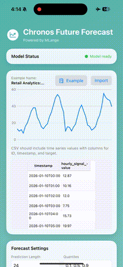
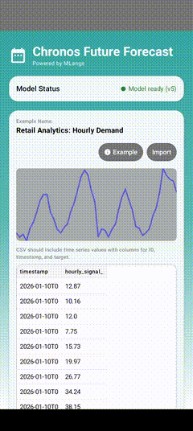

# Chronos Bolt: Time Series Forecasting

<div align="center" style="display: flex; justify-content: center; gap: 16px; margin-bottom: 12px;">
  <div align="center">
    
    <div style="margin-top: 6px; font-size: 12px;">iPhone 15 Pro</div>
  </div>
  <div align="center">
    
    <div style="margin-top: 6px; font-size: 12px;">Galaxy S25</div>
  </div>
</div>

<div align="center">

**Probabilistic Time Series Forecasting with Chronos Bolt**

[](https://mlange.zetic.ai)
[](iOS/)
[](Android/)

</div>

> [!TIP]
> **View on MLange Dashboard**: [Team_ZETIC/Chronos-balt-tiny](https://mlange.zetic.ai/p/Team_ZETIC/Chronos-balt-tiny?from=use-cases) - Contains generated source code & benchmark reports.

## 🚀 Quick Start

Get up and running in minutes:

1. **Get your MLange API Key** (free): [Sign up here](https://mlange.zetic.ai)
2. **Configure API Key**:
   ```bash
   # From repository root
   ./adapt_mlange_key.sh
   ```
3. **Run the App**:
   - **iOS**: Open `iOS/` in Xcode
   - **Android**: Open `Android/` in Android Studio
   - Build and run on a device or simulator

## 📚 Resources

- **MLange Dashboard**: [View Model & Reports](https://mlange.zetic.ai/p/Team_ZETIC/Chronos-balt-tiny?from=use-cases)
- **Use Cases**: [Chronos Bolt on Use Cases Page](https://mlange.zetic.ai/use-cases) → [Direct Link](https://mlange.zetic.ai/p/Team_ZETIC/Chronos-balt-tiny?from=use-cases)
- **Documentation**: [MLange Docs](https://docs.zetic.ai)

## 📋 Model Details

- **Model**: Chronos Bolt Tiny
- **Task**: Time Series Forecasting
- **MLange Project**: [Team_ZETIC/Chronos-balt-tiny](https://mlange.zetic.ai/p/Team_ZETIC/Chronos-balt-tiny?from=use-cases)
- **Key Features**:
  - Probabilistic forecasting (quantiles)
  - Zero-shot performance on unseen time series
  - CSV import and table editor; interactive charts
  - NPU-accelerated inference via MLange

This application showcases the **Chronos Bolt Tiny** model using **MLange**. Chronos Bolt is a time series forecasting model optimized for on-device inference. The app supports CSV import, quantile forecasts, and interactive visualization of prediction intervals.

## 📁 Directory Structure

```
ChronosTimeSeries/
├── prepare/      # Model & input preparation scripts
├── iOS/          # iOS implementation with MLange SDK
└── Android/      # Android implementation with MLange SDK
```
