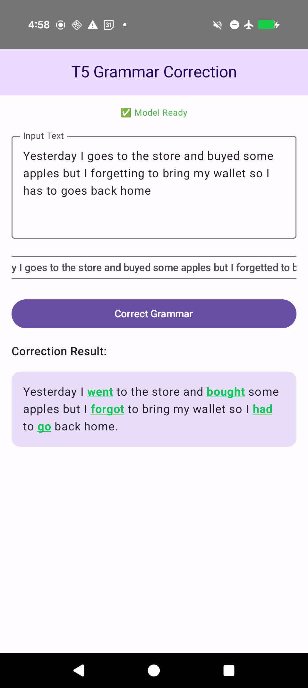
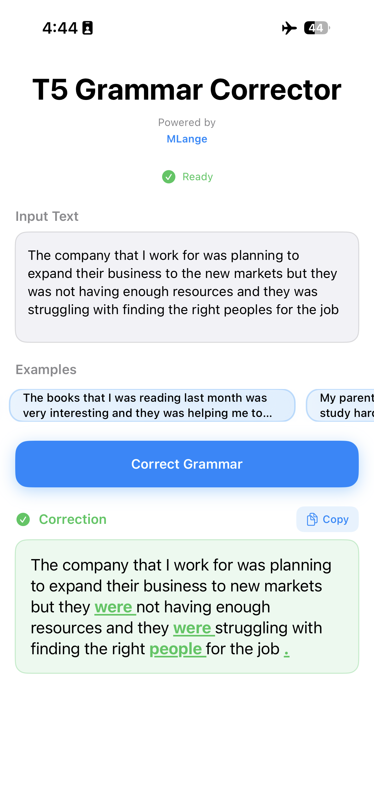

# T5 Grammar Correction

<div align="center">

**Robust Grammar Correction Based on T5 Architecture**

[](https://mlange.zetic.ai)
[](Android/)
[](iOS/)

</div>

> [!TIP]
> **View on MLange Dashboard**: [Team_ZETIC/t5-base-grammar-correction](https://mlange.zetic.ai/p/Team_ZETIC/t5-base-grammar-correction?from=use-cases) - Contains generated source code & benchmark reports.

## 🚀 Quick Start

Get up and running in minutes:

1. **Get your MLange API Key** (free): [Sign up here](https://mlange.zetic.ai)
2. **Configure API Key**:
   ```bash
   # From repository root
   ./adapt_mlange_key.sh
   ```
3. **Run the App**:
   - **Android**: Open `Android/` in Android Studio
   - **iOS**: Open `iOS/` in Xcode

## 📚 Resources

- **MLange Dashboard**: [View Model & Reports](https://mlange.zetic.ai/p/Team_ZETIC/t5-base-grammar-correction?from=use-cases)
- **Use Cases**: [T5 Grammar Correction on Use Cases Page](https://mlange.zetic.ai/use-cases) → [Direct Link](https://mlange.zetic.ai/p/Team_ZETIC/t5-base-grammar-correction?from=use-cases)
- **Base Model**: [vennify/t5-base-grammar-correction](https://huggingface.co/vennify/t5-base-grammar-correction) on Hugging Face
- **Documentation**: [MLange Docs](https://docs.zetic.ai)

## 📋 Model Details

- **Model**: T5 Base Grammar Correction
- **Task**: Grammar Correction
- **MLange Project**: [Team_ZETIC/t5-base-grammar-correction](https://mlange.zetic.ai/p/Team_ZETIC/t5-base-grammar-correction?from=use-cases)
- **Base Model**: [vennify/t5-base-grammar-correction](https://huggingface.co/vennify/t5-base-grammar-correction) on Hugging Face
- **Architecture**: T5 (Text-to-Text Transfer Transformer)
- **Key Features**:
  - Automatic grammar error detection and correction
  - Real-time text processing with greedy decoding
  - Supports various grammar errors (tense, articles, prepositions, subject-verb agreement)
  - NPU-accelerated inference via MLange

This application showcases the **T5 Base Grammar Correction** model using **MLange**. The model provides robust grammar correction capabilities based on the T5 transformer architecture, optimized for mobile devices with NPU acceleration.

### Supported Grammar Error Types

The model can correct various types of grammar errors including:
- **Tense errors**: "He go to school" → "He goes to school"
- **Article errors**: "I has a apple" → "I have an apple"
- **Preposition errors**: "interested on" → "interested in"
- **Subject-verb agreement**: "My grammar are bad" → "My grammar is bad"
- **Singular/plural agreement**: "The students was" → "The students were"

## � Screenshots

<div align="center">
  
  
</div>

## �📁 Directory Structure

```
t5_base_grammar_correction/
├── prepare/      # Model & input preparation scripts
│   └── script/   # Python scripts for model export and inference
├── Android/       # Android implementation with MLange SDK
│   └── app/
│       └── src/main/
│           ├── java/com/zeticai/t5grammar/
│           │   ├── MainActivity.kt      # Main UI
│           │   ├── T5ModelManager.kt   # Model handling
│           │   └── Tokenizer.kt        # Custom tokenizer
│           └── assets/
│               └── t5_vocab.json       # Tokenizer vocabulary
└── iOS/          # iOS implementation with MLange SDK
    └── T5GrammarCorrection-iOS/
        ├── T5GrammarCorrection_iOSApp.swift
        └── View/
            ├── T5GrammarCorrectionView.swift
            └── Tokenizer.swift
```

## 🔧 Technical Details

### Model Architecture

- **Base Model**: T5 (Text-to-Text Transfer Transformer)
- **Input Format**: Text with "grammar: " prefix
- **Output Format**: Corrected text
- **Decoder Length**: 128 tokens (fixed buffer)
- **Encoder Length**: 1024 tokens (fixed buffer)

### Inference Process

1. **Tokenization**: Input text is tokenized using custom SentencePiece-based tokenizer
2. **Encoding**: Text is encoded with "grammar: " prefix and padded to 1024 tokens
3. **Decoding**: Greedy decoding loop generates corrected text token by token
4. **Post-processing**: Tokens are decoded back to human-readable text

### Key Implementation Details

- **Custom Tokenizer**: Implements T5 SentencePiece tokenization logic
- **Fixed Buffer Inference**: Uses stateless model with fixed-length buffers
- **Greedy Decoding**: Simple and efficient decoding strategy
- **NPU Optimization**: Fully optimized via MLange for on-device performance

## 💡 Features

- ✅ **Real-time Correction**: Instant grammar correction as you type
- ✅ **Multiple Error Types**: Handles various grammar mistakes
- ✅ **Example Sentences**: Pre-loaded examples with common errors
- ✅ **Diff Highlighting**: Visual highlighting of corrected words
- ✅ **Copy Functionality**: Easy copy of corrected text
- ✅ **Cross-Platform**: Available for both Android and iOS
