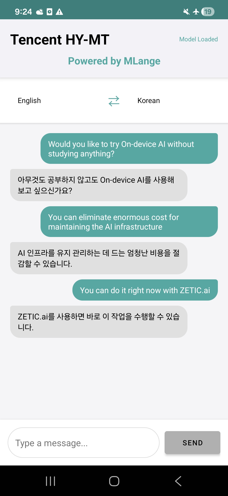
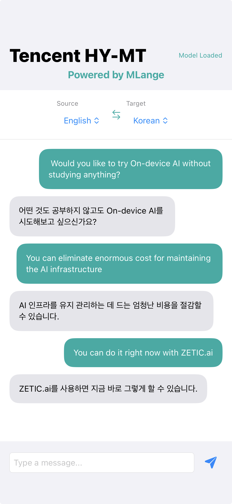

# Tencent HY-MT

<div align="center" style="display: flex; justify-content: center; gap: 40px; margin: 20px 0;">
  <div align="center">
    
    <div style="margin-top: 10px;">Samsung Galaxy S24</div>
  </div>
  <div align="center">
    
    <div style="margin-top: 10px;">iPhone 15 Pro</div>
  </div>
</div>

<div align="center">

**Hybrid Machine Translation for 40+ Languages**

[](https://mlange.zetic.ai)
[](Android/)
[](iOS/)

</div>

> [!TIP]
> **View on MLange Dashboard**: [vaibhav-zetic/tencent_HY-MT](https://mlange.zetic.ai/p/vaibhav-zetic/tencent_HY-MT?tab=summary) - Contains generated source code & benchmark reports.

## 🚀 Quick Start

Get up and running in minutes:

1. **Get your MLange API Key** (free): [Sign up here](https://mlange.zetic.ai)
2. **Configure API Key**:
   ```bash
   # From repository root
   ./adapt_mlange_key.sh
   ```
3. **Run the App**:
   - **Android**: Open `Android/` in Android Studio
   - **iOS**: Open `iOS/` in Xcode

## 📚 Resources

- **MLange Dashboard**: [View Model & Reports](https://mlange.zetic.ai/p/vaibhav-zetic/tencent_HY-MT?from=use-cases)
- **Use Cases**: [Tencent HY-MT on Use Cases Page](https://mlange.zetic.ai/use-cases) → [Direct Link](https://mlange.zetic.ai/p/vaibhav-zetic/tencent_HY-MT?from=use-cases)
- **Documentation**: [MLange Docs](https://docs.zetic.ai)

## 📋 Model Details

- **Model**: Tencent HY-MT (Hybrid Machine Translation)
- **Task**: Machine Translation
- **MLange Project**: [vaibhav-zetic/tencent_HY-MT](https://mlange.zetic.ai/p/vaibhav-zetic/tencent_HY-MT?from=use-cases)
- **Supported Languages**: **40+ languages** with comprehensive coverage
- **Key Features**: 
  - Real-time translation with streaming output
  - Bidirectional translation support with smart context management
  - Instant language swapping
  - "Powered by MLange" branding
  - NPU-optimized via MLange

This application showcases the **Tencent HY-MT** model using **MLange**. HY-MT is a hybrid machine translation model that provides high-quality translations across 40+ languages, optimized for on-device inference with NPU acceleration.

### 🌍 Comprehensive Language Support

One of the key advantages of Tencent HY-MT is its extensive language coverage. The model supports **40+ languages**, making it ideal for global applications that need to serve diverse user bases. This comprehensive support eliminates the need for multiple translation models or services, simplifying deployment and reducing infrastructure complexity.

**Supported Languages (40 languages):**

| **Language** | **Language** | **Language** | **Language** |
|:---:|:---:|:---:|:---:|
| Chinese | English | French | Portuguese |
| Spanish | Japanese | Turkish | Russian |
| Arabic | Korean | Thai | Italian |
| German | Vietnamese | Malay | Indonesian |
| Filipino | Hindi | Traditional Chinese | Polish |
| Czech | Dutch | Khmer | Burmese |
| Persian | Gujarati | Urdu | Telugu |
| Marathi | Hebrew | Bengali | Tamil |
| Ukrainian | Tibetan | Kazakh | Mongolian |
| Uyghur | Cantonese | | |
||

**Benefits of Multi-Language Support:**
- **Single Model Solution**: One model handles all supported language pairs, reducing deployment complexity
- **Cost Efficiency**: No need to maintain separate models for different language combinations
- **Consistent Quality**: Unified architecture ensures consistent translation quality across all language pairs
- **Easy Expansion**: Add new language pairs without architectural changes
- **On-Device Performance**: NPU acceleration via MLange ensures fast inference even with extensive language coverage

## 📁 Directory Structure

```
tencent_HY-MT/
├── Android/      # Android implementation with MLange SDK
└── iOS/          # iOS implementation with MLange SDK
```
